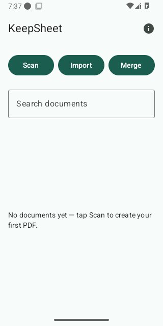
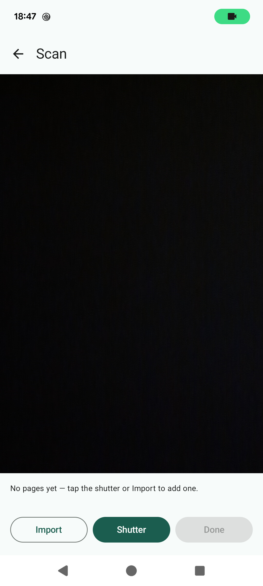

# KeepSheet — User Manual

KeepSheet turns paper and photos into clean, searchable PDFs, and merges
existing PDFs into one, in whatever order you choose. Everything happens on
your device — no accounts, no cloud.

_This manual will grow screenshots as each screen is implemented — see
[`specs/ui-flows.md`](../specs/ui-flows.md) for the authoritative
description of every screen and control in the meantime._

## Home

The app's entry point. Shows your documents, most recent first — each row
with its name, date, page count, and size. Tap a row to open it.

- **Scan** — capture pages with your camera.
- **Import** — turn existing photos into a document without opening the
  camera.
- **Merge** — combine two or more existing PDFs into one.
- The search field filters your documents by name or recognized text.
- Each row has its own delete action.

## Capture

Opened by **Scan**. A live camera view — tap the shutter to capture a
page. Captured pages appear in a thumbnail strip below, where you can drag
to reorder them, retake one, or remove it. Add more photos via **Import**
without leaving this screen. If camera access isn't granted, this screen
explains why and still lets you add pages with Import. Tap **Done** once
every page is captured.

## Page Review

Reached from Capture, or directly from Home's **Import**. Fine-tune each
page before saving: adjust its crop, choose a filter (color, grayscale, or
black-and-white), reorder, retake, or remove pages. Tap **Save** to build
the PDF — KeepSheet suggests a file name automatically, and starts
recognizing text in the background so the document becomes searchable.

## Merge

Opened by **Merge**. Pick two or more existing PDFs — from KeepSheet's own
documents or from your device — and drag to set the order they'll be
combined in. Tap **Merge** to produce the combined PDF.

## Document Detail

Opened by tapping any document. Shows the PDF's pages, its name (tap to
rename), date, page count, and size. **Share** hands the PDF to any app you
choose; **Delete** removes it, with a confirmation step first.

## Feedback and support

Tap the ⓘ icon on Home for KeepSheet's version, your device's model and
Android version, and links to report an issue or reread this manual.

Found a bug or have a feature idea? Open an issue at
<https://github.com/tomasbjerre/keepsheet/issues>.
